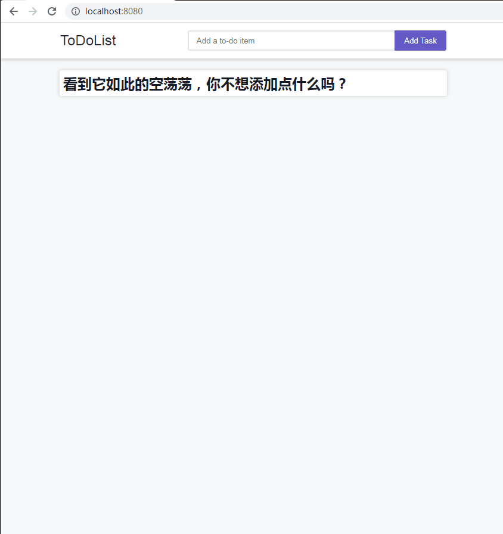

# ToDoList
一个基于 gin + gorm 开发的练手小项目

## 项目截图


## 项目功能
- todo 任务的增删查改

## 项目运行（ windows下 ）
```bash
# 克隆项目
$ git clone https://github.com/wtraceback/ToDoList.git
# 切换至目录
$ cd ToDoList
# 安装依赖
$ go get
# 运行项目
$ go run main.go

# 额外说明：
# 如果在运行中遇到需要安装 MinGW-W64 GCC
# 请参考博客：https://www.cnblogs.com/wanghuizhao/p/17689039.html
```

## 项目运行（ Ubuntu服务器下-在docker中运行 ）
```bash
# 克隆项目
$ git clone https://github.com/wtraceback/ToDoList.git
# 切换至目录
$ cd ToDoList
# 构建 Docker 镜像
$ docker build -t todolist .
# 使用镜像，启动容器
$ docker run -d -p 8080:8080 todolist

# 查看启动后的容器
docker ps
```
